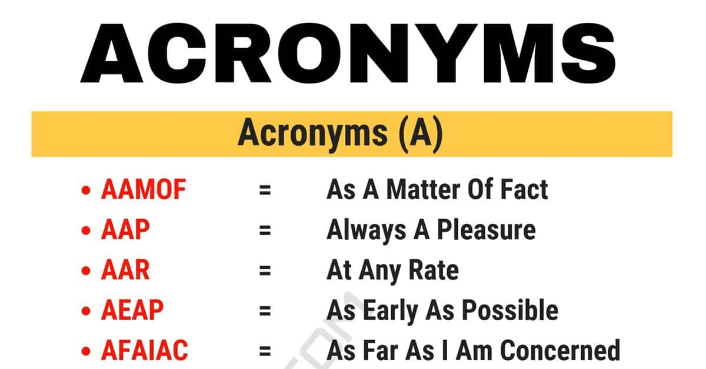

h1 align="center"> Create Acronyms using Python</h1>
<dev>

</dev>

To create acronyms using Python, you need to write a python program that generates a short form of a word from a given sentence. You can do this by splitting and indexing to get the first word and then combine it. Let’s see how to create an acronym using Python:

<h2> The use of acronyms </h2>

 
Acronyms can be a useful tool in coming up with a name for a new product, company, or initiative. By taking the first letter of each word in a phrase or sentence that represents the essence of what the product, company, or initiative does or stands for, it can be used to form a catchy, memorable, and easily recognizable acronym. For example, NASA stands for National Aeronautics and Space Administration. The acronym helps people easily associate the organization with its purpose, which is to research and explore space. In this way, using acronyms can help create a strong brand identity and make it easier for people to recall and recognize the name of a product or company.

